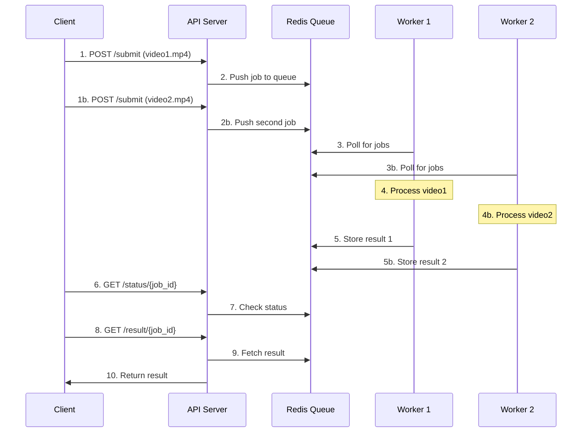

# Distributed Processing System

A scalable distributed system for processing using FastAPI, Redis Queue (RQ), and Python. The system allows asynchronous processing through a REST API interface.

[👉 Click here for detailed setup instructions](SETUP.md)

## System Overview

The system consists of three main components:

### 1. Worker Job (`app/worker_job.py`)
Your processing function:
```python
def process_video(video_path):
    # your processing logic here
    return f"{video_path}_processed.mp4"
```
This function does the actual work.

### 2. Worker Runner (`worker_runner.py`)
A smart Python script that:
- Connects to Redis queue
- Spawns multiple worker processes (default: 2)
- Each worker waits for jobs
- Runs the process_video function
- Sends result back to Redis

You can control the number of workers:
```bash
# In your .env file
NUM_WORKERS=3  # Run 3 parallel workers
```

Each worker runs independently, so if you have 3 workers:
- Worker_1 could be processing video1.mp4
- Worker_2 could be processing video2.mp4
- Worker_3 could be processing video3.mp4

All at the same time! 🚀

### 3. API Server (`app/api.py`)
FastAPI app exposes these endpoints:

| Endpoint | Method | Description |
|----------|--------|-------------|
| `/submit` | POST | Submit a processing job. Returns a job_id |
| `/status/{job_id}` | GET | Check job status (queued, started, finished, failed) |
| `/result/{job_id}` | GET | Get the final result once job is done |

Example `/submit` endpoint:
```python
@app.post("/submit")
def submit_job(video_path: str):
    job = q.enqueue(process_video, video_path)
    return {"status": "queued", "job_id": job.id}
```

## How It All Works Together



1. Client submits multiple jobs → API adds them to Redis queue
2. Multiple workers pick up different jobs simultaneously
3. Each worker processes its job independently
4. Results are saved back to Redis as they complete
5. Client can check status and get results for any job

## Quick Summary

- **Worker Job** = your processing function
- **Worker Runner** = spawns multiple workers to process jobs in parallel
- **API Server** = client interface for submitting/checking jobs
- All communicate via **Redis** as the queue broker

## Features

- ✨ Asynchronous job processing
- 🚀 Multiple worker support (process jobs in parallel)
- 📊 Job status tracking
- 🔄 Multiple queue support (default, heavy, fast)
- 🛠 Environment-based configuration
- 🔍 Detailed job status and results
- 💪 Automatic load balancing between workers
- 🔒 Graceful shutdown handling

## Next Steps

- [Setup Instructions](SETUP.md)