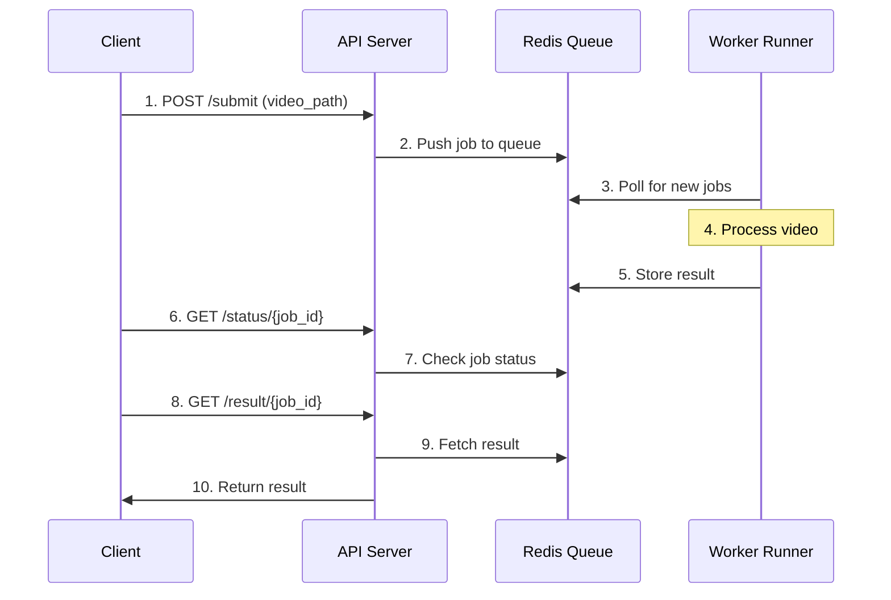

# Distributed Processing System

A scalable distributed system for processing using FastAPI, Redis Queue (RQ), and Python. The system allows asynchronous processing through a REST API interface.

[👉 Click here for detailed setup instructions](SETUP.md)

## System Overview

The system consists of three main components:

### 1. Worker Job (`app/worker_job.py`)
Your processing function:
```python
def process_video(video_path):
    # your processing logic here
    return f"{video_path}_processed.mp4"
```
This function does the actual work.

### 2. Worker Runner (`worker_runner.py`)
A small Python script that:
- Connects to Redis queue
- Waits for new jobs
- Runs the process_video function
- Sends result back to Redis

You run this script to process jobs from the queue.

### 3. API Server (`app/api.py`)
FastAPI app exposes these endpoints:

| Endpoint | Method | Description |
|----------|--------|-------------|
| `/submit` | POST | Submit a processing job. Returns a job_id |
| `/status/{job_id}` | GET | Check job status (queued, started, finished, failed) |
| `/result/{job_id}` | GET | Get the final result once job is done |

Example `/submit` endpoint:
```python
@app.post("/submit")
def submit_job(video_path: str):
    job = q.enqueue(process_video, video_path)
    return {"status": "queued", "job_id": job.id}
```

## How It All Works Together



1. Client calls `/submit` with input path → API adds job to Redis queue
2. Worker Runner listens to Redis → picks job → runs processing
3. Worker Runner finishes job → saves result in Redis
4. Client polls `/status/{job_id}` to see progress
5. Client fetches result from `/result/{job_id}` when done

## Quick Summary

- **Worker Job** = your processing function
- **Worker Runner** = script that runs your job when Redis has it
- **API Server** = client interface for submitting/checking jobs
- All communicate via **Redis** as the queue broker

## Features

- ✨ Asynchronous job processing
- 🚀 Multiple worker support
- 📊 Job status tracking
- 🔄 Multiple queue support (default, heavy, fast)
- 🛠 Environment-based configuration
- 🔍 Detailed job status and results

## Next Steps

- [Setup Instructions](SETUP.md)